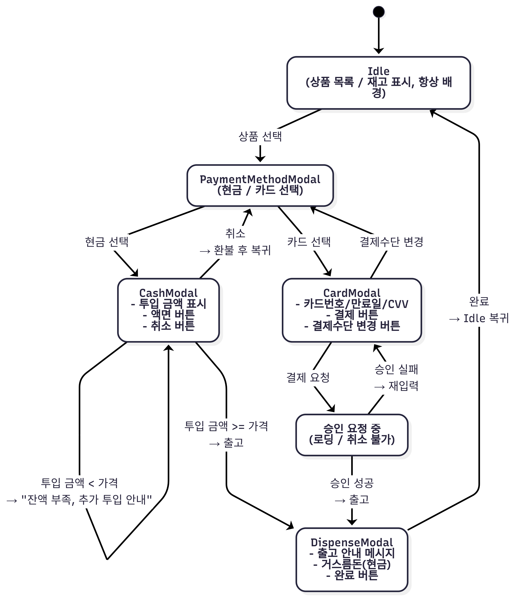

# 📄 REPORT.md (과제 제출용 요약 문서)

버전: v1.0.0
작성일: 2025-09-06

---

## 1. 요구사항 정리 (Requirements)

- **상품 선택**
  - 재고가 0인 상품은 선택 불가 (비활성화 처리)

- **결제 수단 선택**
  - Idle 화면에서 상품 선택 시 모달 오픈
  - 현금 / 카드 중 하나 선택 가능

- **현금 결제 (CashModal)**
  - 100 / 500 / 1000 / 5000 / 10000 단위만 입력 가능
  - 투입 금액이 상품 가격보다 작을 경우 → **투입 금액 안내 + 추가 투입 유도**
  - 투입 금액이 상품 가격 이상일 경우 → **상품 출고 + 거스름돈 반환**
  - 취소 시 → **전액 환불 후 PaymentModal 복귀**

- **카드 결제 (CardModal)**
  - 카드번호 / 만료일 / CVV 입력 후 승인 요청
  - 승인 요청 중에는 취소 불가 (로딩 상태)
  - 승인 성공 → **상품 출고**
  - 승인 실패 → **재입력 유도**, 필요 시 결제 수단 변경 가능

- **출고 및 완료 (DispenseModal)**
  - 출고 안내 메시지 표시
  - 현금 결제 시 거스름돈 반환
  - 완료 버튼 클릭 시 모달 닫기 → Idle 화면 복귀

---

## 2. 내용 정리 (System Flow)

### 🖼️ 상태도 (모달 UX 기반)

### 🔄 동작 흐름 요약

1. Idle 화면에서 사용자가 상품 선택
2. **PaymentModal** 열림 → 결제 수단 선택
3. **현금 결제 플로우**
   - 금액 단위 버튼으로 투입
   - 부족 시 투입 금액 표시
   - 충족 시 DispenseModal → 출고 + 거스름돈 반환
   - 취소 시 전액 환불 후 PaymentModal 복귀
4. **카드 결제 플로우**
   - 카드번호 / 만료일 / CVV 입력 후 승인 요청
   - 승인 성공 시 DispenseModal → 출고
   - 승인 실패 시 CardModal 유지 → 재입력 또는 결제 수단 변경
5. **DispenseModal**
   - 출고 안내 메시지 확인 후 완료 버튼 클릭
   - 모달 종료 → Idle 화면 유지

---

### 카드 결제 시뮬레이션 규칙

- **승인 카드**: 번호 `4111-1111-1111-1111`, CVV `123`
- **거절 카드**: 번호 `4000-0000-0000-0002`, CVV `000`
- **그 외 카드**: 임의 3자리 CVV와 함께 입력 시 80% 확률로 승인, 20% 확률로 거절

## 3. 문서 목적 (Purpose)

본 문서는 자판기 결제 시뮬레이션의 **요구사항과 동작 흐름을 간결하게 시각화·정리**하여,  
평가자 및 개발자가 시스템 구조를 빠르게 이해할 수 있도록 하는 것을 목표로 합니다.
